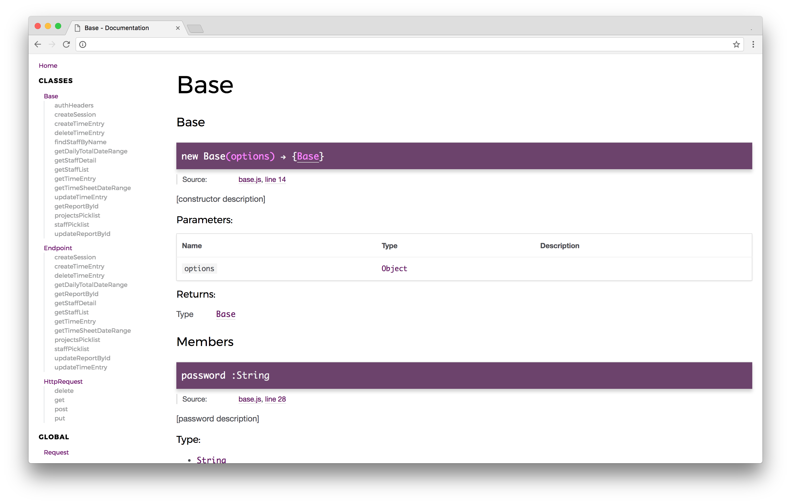

# BigTime SDK
Node wrapper for interacting with the [BigTime API](http://iq.bigtime.net/BigtimeData/api/v2/help/Overview).

[](https://badge.fury.io/js/@imaps%2Fbigtime-sdk)

## Installation

`npm install --save @imaps/bigtime-sdk`

## Usage

```js
const BigTime = require('bigtime-sdk');

const bigTime = new BigTime();

(async () => {
  try {
    await bigTime.createSession(YOUR_USERNAME, YOUR_PASSWORD);
    const staffListResponse = await bigTime.getStaffList();
    // etc.
  } catch (err) {
    console.log(err.name, err.message);
  }
})()
```

## Tests

`npm test`

```
213 passing (174ms)

-------------------------|----------|----------|----------|----------|-------------------|
File                     |  % Stmts | % Branch |  % Funcs |  % Lines | Uncovered Line #s |
-------------------------|----------|----------|----------|----------|-------------------|
All files                |      100 |      100 |      100 |      100 |                   |
 src                     |      100 |      100 |      100 |      100 |                   |
  base.js                |      100 |      100 |      100 |      100 |                   |
  endpoint.js            |      100 |      100 |      100 |      100 |                   |
  http-request.js        |      100 |      100 |      100 |      100 |                   |
 src/util                |      100 |      100 |      100 |      100 |                   |
  get-current-date.js    |      100 |      100 |      100 |      100 |                   |
  index.js               |      100 |      100 |      100 |      100 |                   |
  populate-url-params.js |      100 |      100 |      100 |      100 |                   |
-------------------------|----------|----------|----------|----------|-------------------|
```

## Documentation

`npm run docs`



## Linting
Refer to the [ESLint docs](https://eslint.org/docs/rules/) and [.eslintrc.json](./.eslintrc.json) for rules.

`npm run lint`

## To Do
- [ ] Normalize `HttpRequest[method]` signatures
- [ ] Use `async`/`await`
- [ ] Namespace resources (`bigTime.picklists.staff()`, etc.)
- [ ] Add timer endpoints
- [ ] Add weekly start date endpoints
- [ ] Add expense endpoints
- [ ] Add projects endpoints
- [ ] Add tasks endpoints
- [ ] Add invoice endpoints
- [ ] Add transaction endpoints
